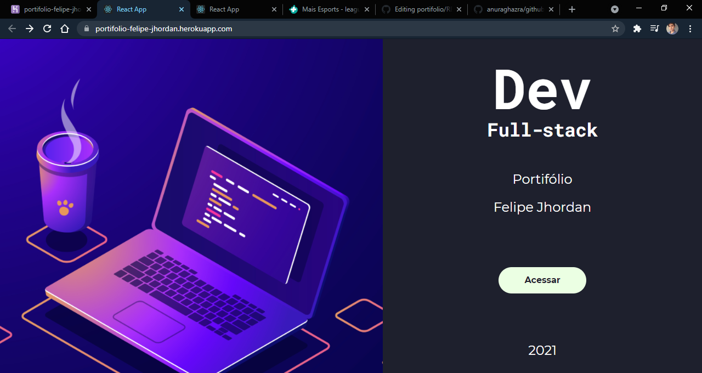
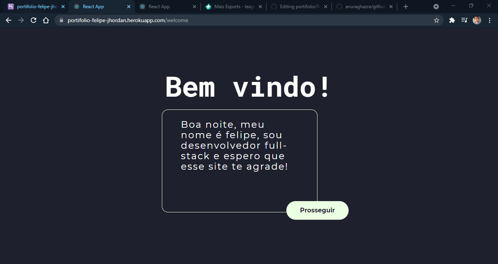
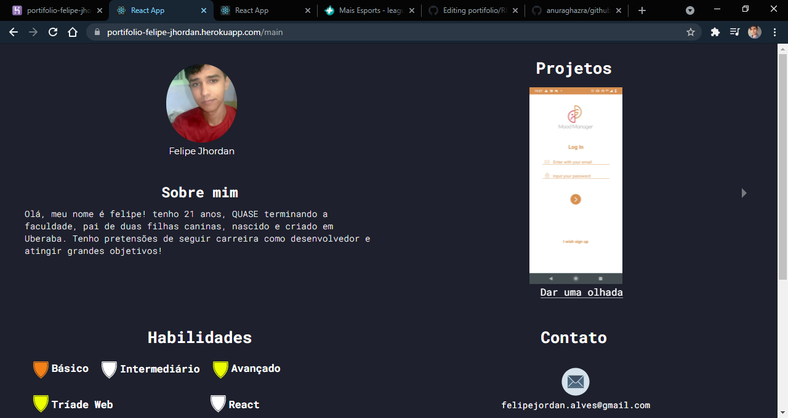
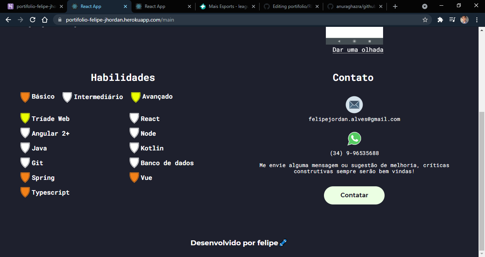
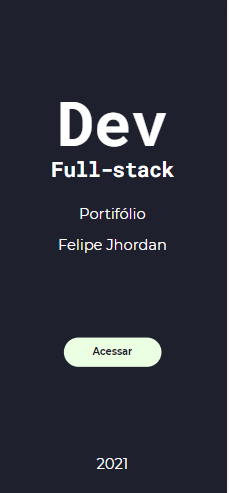
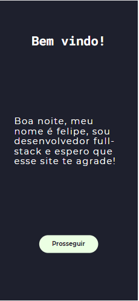
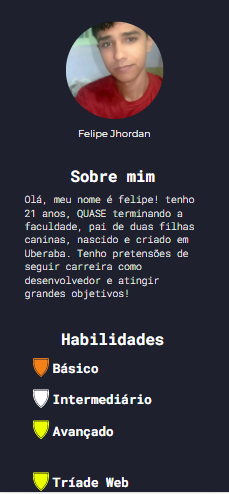
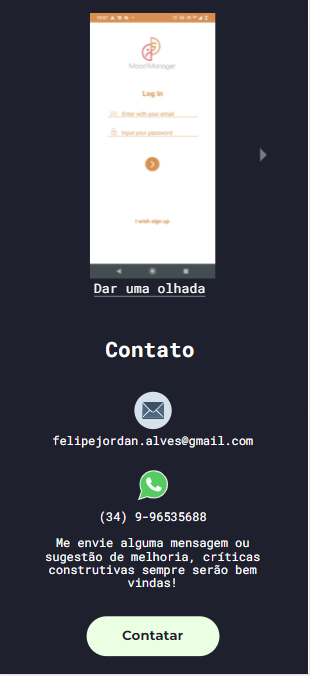

# Portifólio  

## Sumário
<!--ts-->
   * [Motivacão](#motivacão)
   * [Site](#site)
   * [Instalação](#instalacão)
   * [Como Executar](#como-executar)
   * [Tecnologias](#tecnologias)
   * [Imagens](#imagens)
<!--te-->

## Motivacão
Criar um "banco" de projetos feitos ou executados por mim, com objetivo de demostrar minha evolução e atrair oportunidades e contatos.
## Site
https://portifolio-felipe-jhordan.herokuapp.com/
## Instalacão
### Para rodar o projeto é necessário:
 - Node v12+
 - Git ( Para clonar )
 
 ### Para instalar é necessário executar os seguintes comanandos: 
 - git clone https://github.com/FelipeJhordan/portifolio.git
 - cd portifolio
 - npm install
## Como Executar
Para executar é necessário aplicar o comando "npm run start"
## Tecnologias
### Frontend
- ReactJS
- Axios
- React-Router
- Slick-Carousel
- React Modal
### Backend
- Json-server
### Implantação
Foi utilizado a plataforma de hospedagem HEROKU para hospedar a aplicação cliente e a api.
## Imagens
<h3>Desktop</h3>
<h4> Home </h4>

   

  
<h4> Welcome </h4>

 

 
<h4> Principal </h4>

 
 
 

 <h3> Mobile </h3>
<h4> Home </h4>

   

  
<h4> Welcome </h4>

 

 
<h4> Principal </h4>

                                                                    
 
 

